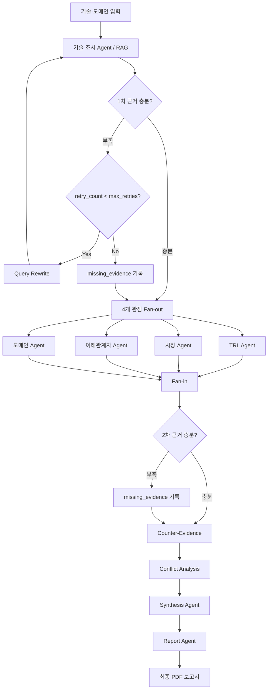

# Subject

본 프로젝트는 데이터센터·클라우드 환경의 KV Cache 최적화 기술을 SW·시스템 관리와 HW·메모리 근접 연산 관점에서 선정하고, TRL·시장·이해관계자·도메인 관점으로 비교 평가하는 Agentic RAG 프로젝트임.

## Overview

- **Objective** : ITME와 CXL-PIM을 복수 관점에서 비교 평가하고 근거 기반 PDF 보고서 생성
- **Method** : Multi-Agent(Distributed) + Agentic RAG
- **Tools** : OpenAI Responses API, Tavily Search, PyMuPDF

## Selected Technologies

- **SW·System : ITME** — 계층형 CXL/NVMe 메모리와 prefetch 제어로 KV Cache 저장 공간을 확장하고 데이터 이동을 관리하는 접근이므로 선정
- **HW : CXL-PIM** — CXL memory 내 PNM 가속기로 token page selection과 attention 연산을 수행해 GPU 메모리 압력과 데이터 이동을 줄이는 접근이므로 선정

> ITME는 순수 SW가 아닌 CXL-hybrid memory와 소프트웨어 제어를 결합한 HW/SW 공동 설계이다. 본 비교에서는 KV Cache 최적화의 주된 제어 지점을 기준으로 구분했다.

## Features

- 핵심·보조 논문 PDF 7편 로딩 및 페이지·출처 메타데이터 보존
- Dense 검색과 BM25를 RRF로 결합한 Hybrid Retrieval
- 기술 조사, TRL, 시장, 이해관계자, 도메인 평가 Agent 분리
- 4개 평가 Agent 병렬 실행 및 Fan-in 통합
- 근거 부족 시 Query Rewrite 후 한정 재검색
- 인용문·출처·기술·수치·실험 조건 검증 및 탈락 사유 기록
- 최종 평가 보고서를 한국어 A4 PDF로 저장
- **확증 편향 방지 전략** : 기술×평가 기준별 독립 검색, 반대 근거 검색, Conflict 분석, 근거 부족과 비교 한계 명시

## Tech Stack

- **Framework** : LangGraph, LangChain
- **LLM/Generator** : `gpt-4.1-mini`
- **LLM/Judge** : `gpt-4.1-mini`
- **Retrieval** : NumPy Vector Index + BM25 + RRF — Hybrid Hit Rate@10 `1.000`, MRR@10 `0.617`
- **Embedding** : `intfloat/multilingual-e5-base`
- **Web Search** : Tavily Search
- **PDF Parsing/Report** : PyMuPDF, ReportLab

> Retrieval 성능은 정답 페이지가 라벨링된 내부 질의 8개를 기준으로 측정한 결과이다.

## Agents

- **Technical Research Agent** : 핵심 논문 RAG 및 기술 근거 추출
- **TRL Evaluation Agent** : 논문·PoC·Prototype·상용화 단계 평가
- **Market Evaluation Agent** : 제품화·도입·생태계·시장성 평가
- **Stakeholder Evaluation Agent** : 개발자·도입 기업·투자 업계 관점 분석
- **Domain Evaluation Agent** : 용량·성능·데이터 이동·확장성·비용 평가
- **Counter-Evidence/Conflict Node** : 반대 근거 검색 및 상충 주장 분석
- **Synthesis Agent** : 공통점·Trade-off·한계·종합 의견 생성
- **Report Agent** : 검증된 State 기반 보고서 및 참고문헌 구성

## Architecture



## Directory Structure

```text
├── data/                  # 논문 PDF, 문서 manifest, 검색 평가 질의
├── agents/                # 기술·TRL·시장·이해관계자·도메인·종합·보고서 Agent
├── nodes/                 # 근거 검사, 재검색, 반증, Conflict 노드
├── rag/                   # PDF 로딩, 청킹, 임베딩, Hybrid Retrieval
├── tools/                 # LLM, Web Search, Query Rewrite, PDF 생성 도구
├── tests/                 # 자동 테스트
├── outputs/               # PDF 보고서, State, 로그
├── app.py                 # CLI 실행 스크립트
├── graph.py               # LangGraph Workflow
├── state.py               # ResearchState Schema
└── README.md
```

## Usage

```bash
# 의존성 설치
uv sync --frozen --extra rag --extra dev

# .env에 OPENAI_API_KEY, TAVILY_API_KEY 설정 후 실행
.venv/bin/python app.py --check
.venv/bin/python app.py --index
.venv/bin/python app.py --run

# 외부 API 없이 Graph 흐름 확인
.venv/bin/python app.py --demo
```

최종 보고서는 `outputs/날짜-실행ID/report.pdf`에 저장된다.

## Contributors

- **백소현** : RAG 파이프라인, 기술 조사 Agent 구현
- **윤정수** : TRL·시장 평가 Agent, Web Search 근거 구조화
- **전상진** : 이해관계자·도메인 평가 Agent, 평가 기준 설계
- **전현찬** : LangGraph·State·Fan-out/Fan-in 전체 흐름 구현
- **정진우** : Evidence 검사·Query Rewrite·Counter-Evidence·Conflict Node 구현
- **정현주** : Synthesis·Report Agent, Reference 연결, 통합 테스트
