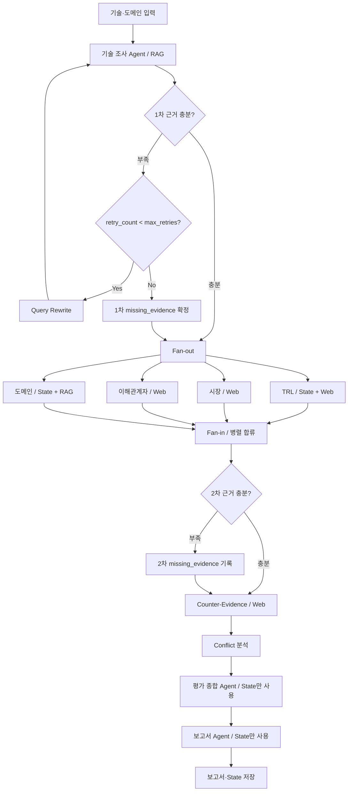

# ITME와 CXL-PIM Agentic RAG 비교 평가

데이터센터·클라우드의 KV Cache 관리 기술을 조사하고, TRL·시장·이해관계자·도메인 관점으로 평가하여 근거가 연결된 보고서를 생성한다. 기술은 사람이 선정하며 특정 기술의 승자를 정하지 않는다.

현재 브랜치: `feat/agentic-rag-evidence-workflow`

작업 기준: `feat/agentic-rag-evidence-workflow`의 `c934664` + 최신 PDF 설계서 및 수정방안. 원본 설계서와 논문 PDF는 수정하지 않았다.

## 빠른 실행

프로젝트 폴더에서 Python 3.11~3.13과 uv를 사용한다.

```bash
uv sync --frozen --extra rag --extra dev
.venv/bin/python app.py --show-graph
.venv/bin/python app.py --demo
.venv/bin/python -m unittest discover -s tests -q
```

`python`이 전역 Python alias라면 가상환경을 활성화해도 alias가 우선할 수 있다. 위처럼 `.venv/bin/python`을 직접 사용하면 정확한 인터프리터가 실행된다. `uv run --extra rag python ...`도 가능하다.

`--demo`는 API와 임베딩 모델 다운로드 없이 가상 자료로 전체 흐름만 검증한다. 보고서에 DEMO 표시가 있으며, 실제 기술 분석 또는 제출 결과로 사용할 수 없다.

### 실제 실행

1. `.env.example`을 참고하여 이 폴더에 `.env`를 만든다.
2. `OPENAI_API_KEY`, `TAVILY_API_KEY`를 설정한다.
3. 생성·판단 모델은 Responses API의 구조화 출력을 지원하는 모델로 지정한다.
4. 아래 순서로 실행한다.

```bash
.venv/bin/python app.py --check
.venv/bin/python app.py --index
.venv/bin/python app.py --run
```

- `--check`: 패키지·키 존재·PDF 경로 점검. 키 값은 표시하지 않고, 인증/잔액/모델 권한까지 검증하지는 않는다.
- `--index`: 첫 실행 시 공개 E5 모델 다운로드. 논문 임베딩은 로컬에서 수행한다. API 키 불필요.
- `--run`: OpenAI 및 Tavily를 호출하며 비용이 발생할 수 있다. 모델 거부, API 인증/통신 오류는 실패로 종료하며 DEMO로 자동 대체하지 않는다.
- 다른 환경 파일: `--env-file /절대경로/.env`. 명시적인 셸 환경변수가 dotenv보다 우선한다.
- 모델·청크·검색 설정은 `.env.example` 참고. 원문 청크/발췌와 질문은 분석을 위해 OpenAI로, 검색 질의는 Tavily로 전송된다. 민감한 비공개 문서를 넣기 전 전송 범위를 확인한다.

### 저장 결과

```text
outputs/
  logs/날짜-실행ID.log
  날짜-실행ID/
    report.md     # SUMMARY, 1~6장, 근거 부록, 실제 인용한 REFERENCE
    state.json    # 16개 State 필드 및 근거/평가 결과
    run.json      # 실행 모드, 모델/검색 설정, 생성 시각
```

현재 보고서 출력 형식은 Markdown이다. PDF/DOCX 변환기는 포함하지 않는다. `state.json`에는 인용문 등 자료 내용이 있으므로 로그와 달리 민감정보 포함 가능성이 있다. 결과·모델 캐시·인덱스·.env는 Git 추적에서 제외한다.

## 설계서 실행 흐름



7개 Agent와 흐름 제어 노드를 분리했다. 네 평가 노드는 실제 병렬 실행되며, 모두 완료된 뒤 Fan-in이 한 번 실행된다.

| 역할/기능 | 파일 | 입력과 책임 |
| --- | --- | --- |
| 기술 조사 | agents/technical.py | 핵심 논문 RAG, 9개 조사 항목의 인용 근거 추출 |
| TRL | agents/trl.py | technical_evidence + Web, 추정 성숙도; Vector DB 직접 호출 없음 |
| 시장 | agents/market.py | Web 자료로 제품화·생태계·도입 장벽 |
| 이해관계자 | agents/stakeholder.py | Web 자료로 개발자·도입 기업·HW 업체·산업계 |
| 도메인 | agents/domain.py | RAG + 기술 근거, 5개 적용성 기준; 보조 논문 5편은 비교 맥락 |
| 종합 | agents/synthesis.py | 4개 평가·반대 근거·상충·부족 항목 종합, 추가 검색 없음 |
| 보고서 | agents/report.py | 기존 결과를 목차에 맞춰 구성, 새 평가/검색 없음 |
| 검사·재검색 | nodes/evidence.py | 1차/2차 검사, 한도 판단, 부족 근거 기록 |
| 반증·상충 | nodes/verification.py | 주요 주장당 Web 검색 1회, 상충 분석 |
| 근거 계약 | evidence.py, schemas.py | 인용문·ID 검증, 구조화 출력, 참고문헌 병합 |
| Graph·State | graph.py, state.py | 17개 노드, 설계서의 State 필드 16개 |

### State와 루프 규칙

- 각 병렬 평가 Agent는 자신의 `*_analysis`만 쓴다. 공용 list reducer에 기대지 않는다.
- Fan-in은 병렬 합류만 담당한다. 보고서가 `technical_evidence`, 네 관점의 evidence, `counter_evidence` 중 **본문에 실제 인용한 출처만** `references`에 저장한다.
- `missing_evidence`는 검사/기록 노드만 변경한다. 1차 재검색 성공 시 기존 1차 부족 목록은 해소된다.
- `retry_count`는 하나의 검색 루프를 나타내는 int이며 기본 한도는 2회다. `--max-retries 0`으로 재검색 없이 계속할 수도 있다.
- Query Rewrite는 부족 항목별 한·영 키워드를 `search_queries`에 저장하고 `retry_count`를 함께 올린다. 기술 조사 Agent는 이 State 값을 읽는다.
- 한도를 소진해도 부족 정보를 유지한 채 평가를 진행한다. 2차 부족은 기록만 하고 전체 Agent를 재실행하지 않는다.
- 반대 근거 검증은 기본 관점당 주요 주장 2개, 총 최대 8개다. 가능한 경우 두 기술을 균등하게 선택한다. 검색 0건은 not_found지만 API 실패는 예외다.

## RAG 구현

문서: 핵심 ITME·CXL-PIM과 보조 InfiniGen·PagedAttention·Mooncake·CENT·CacheGen, 총 7편 116페이지다. 최대 허용치는 200페이지다.

1. PyMuPDF로 페이지별 텍스트 블록을 추출하고 두 단 편집의 읽기 순서를 정리한다.
2. 페이지·문단·절 경계를 보존한다. 표 페이지는 캡션·단위·조건을 포함한 페이지 전체를 인용 parent로 두고, 400토큰 child를 검색한다.
3. `technology, document_id, page, chunk_id, role, source_url`을 모든 청크에 보존한다.
4. E5 입력에 `query: ` / `passage: `를 붙이고 임베딩을 정규화한다.
5. Dense 코사인 순위와 BM25 순위를 RRF `Σ 1/(60+rank)`로 결합한다.
6. 기술/문서 역할 필터를 반영한 순위를 구한 뒤 top-k를 선택한다.

벡터 저장소는 **NumPy 정확 검색**이다. 이 소규모 코퍼스에서는 전체 행렬의 코사인 검색으로 충분하며, 로컬 검증 중 발견된 FAISS/PyTorch의 중복 OpenMP 충돌을 피한다. E5 + Dense/BM25라는 설계서는 유지하며, 특정 벡터 DB를 요구하지 않는다. 인덱스는 `vectors.npy`, `chunks.json`, `meta.json`으로 저장하고 pickle을 사용하지 않는다.

모델 revision은 검증한 E5 버전으로 고정한다. PDF 내용·manifest·모델/revision·분할 설정·인덱스 형식이 바뀌면 새 캐시를 만든다. 기존 캐시는 삭제하지 않는다. 파일 해시/청크 수 검증에 실패한 캐시는 재생성한다.

초기값은 400토큰, 겹침 50토큰, Dense 10개, BM25 10개, RRF 이후 최종 5개다. 실제 passage prefix와 특수 토큰을 포함해 512토큰 이하인지 검사한다. 표 감지와 캡션 보존은 휴리스틱이므로 그림 속 수치와 OCR 결과까지 보장하지 않는다.

### 검색 평가

`data/retrieval_cases.json`에는 원리·실험 환경·성능·한계점에 대한 한·영 20개 질의와 사람이 확인한 페이지·anchor가 있다.

```bash
.venv/bin/python scripts/evaluate_retrieval.py
```

small/base의 페이지 기준 Hit@5, MRR@5, 인덱스 준비 시간과 평균 질의 시간을 기록한다. 최근 측정값과 원시 결과는 [검증 기록](docs/verification.md)과 [검색 결과](docs/retrieval-results.json)에 있다.

## 근거와 보고서 검증 범위

- LLM은 Pydantic 기반 구조화 출력으로 응답한다. 가져온 문서/웹 내용은 지시문이 아닌 비신뢰 자료로 취급한다.
- 인용문이 전달한 청크에 존재하는지, 출처/페이지 및 근거 ID가 유효한지 확인하고 별도 LLM 판정으로 대상·범위·의미의 일치 여부를 보수적으로 검사한다.
- 성능 수치는 실험 조건의 원문 인용과 해당 청크를 함께 요구한다. 같은 논문의 다른 페이지에 있는 조건도 연결할 수 있다.
- 다른 기술의 근거만으로 대상 기술을 평가한 주장은 제외한다. TRL은 공개 정보 기반 추정임을 표시한다.
- 조건이 다른 수치는 우열의 직접 근거로 사용하지 않도록 요청하고, 수치 근거의 조건과 비교 제한을 보고서에 남긴다.
- 문자열·수치 검사와 의미 검증은 오류를 줄이기 위한 자동 검사이며 완전한 사실성 보장은 아니다. 추정 TRL과 웹 자료의 최신성은 최종 제출 전 사람의 검토가 필요하다.
- SUMMARY는 700자 이내로 제한한다. 실제 반 페이지 여부는 제출 문서의 글꼴/레이아웃에 따라 확인해야 한다.

## 실행 흐름 로그

기본 로그는 stderr와 `outputs/logs/`에 함께 저장된다. 보고서/State/Mermaid 출력은 stdout이다.

```bash
.venv/bin/python app.py --demo --scenario retry_exhausted --log-level DEBUG
.venv/bin/python app.py --run --log-file outputs/custom-workflow.log
```

| 로그 | 의미 |
| --- | --- |
| RUN_START / RUN_DONE / RUN_FAILED | 전체 실행 시작·완료·실패 |
| GRAPH_BUILD / GRAPH_READY | Graph 구성·컴파일 |
| NODE_START / NODE_DONE / NODE_FAILED | 노드, 시간, 갱신 State 필드/크기, 오류 위치 |
| ROUTE_SELECTED / QUERY_REWRITE / RETRY_EXHAUSTED | 분기, 재검색 전략, 한도 소진 |
| FAN_OUT / FAN_IN | 4개 병렬 평가 시작과 합류 |
| OP_START / OP_DONE / OP_FAILED | PDF·분할·임베딩·검색·API 처리 단계 |
| EVIDENCE_CHECK / EVIDENCE_EXTRACTED | 부족 개수, 채택/제외 근거 수 |
| EVALUATION_READY / COUNTER_RESULT / CONFLICT_RESULT | 관점 결과와 검증 결과 |
| LLM_USAGE / REPORT_CITATIONS / REPORT_SAVED | 토큰 수, 인용 수, 저장 위치 |

모든 내부 로그에 실행 ID를 유지한다. DEBUG도 원문·프롬프트·키·외부 오류 본문은 기록하지 않고 필드 크기만 표시한다. 예외를 삼키지 않으며 CLI 종료 코드는 실패 시 1이다.

## 검증과 남은 확인

- 자동 테스트: 정상 흐름, 재검색 성공/소진, 2차 부족, 병렬 합류, 반대 근거, 출처 검증, API 오류, 로그 비노출, PDF 로딩/분할, 캐시 재사용/손상 검출.
- 실제 E5 임베딩 및 논문 인덱스/검색은 별도 smoke test로 확인한다.
- 실제 모델·웹 검색을 모두 연결한 보고서의 내용 품질은 아직 검증하지 않았다. Tavily 키 설정 후 `--run`으로 검증해야 한다.
- DEMO 보고서는 실행 검증용이다. 정량 검색 평가 점수와 실제 평가 보고서가 생성됐다고 간주하지 않는다.
- 조원별 Contributors는 실제 수행 역할을 확인해 작성한다.

## 구현 참고

[OpenAI 구조화 출력](https://developers.openai.com/api/docs/guides/structured-outputs), [LangGraph Graph API](https://docs.langchain.com/oss/python/langgraph/graph-api), [E5 모델 카드](https://huggingface.co/intfloat/multilingual-e5-base), [Tavily Search](https://docs.tavily.com/documentation/api-reference/endpoint/search).

`handout.md`와 `note.md`는 이전 작업 분담/설계 기록이다. 현재 동작은 최신 DOCX를 반영한 이 README와 코드가 기준이다.
